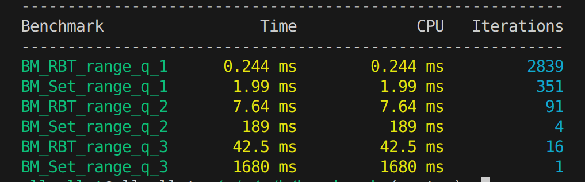

# 2Q and Perfect cache 
# Установка и сборка
Клонируйте репозиторий, перейдите в папку с ним.
Сборка проекта:
> Note: `<Результат сборки будет лежать в в поддиректории проекта build*`
```sh
cmake -B build -DCMAKE_BUILD_TYPE=Release -DCMAKE_EXPORT_COMPILE_COMMANDS=ON
```

# Исползование 
## Тесты :
Запуск unit тестов происходит через Google Test. 
> Note: `<Все необходимые файлы для работы с Google Test автоматически добавятся к проекту.>*`
Все тесты лежат в директории репозитория в папке "tests". 

запуск end-to-end тестов:
> Note: `<end-to-end тесты лежат в поддректоии проекта /tests.>*`
```sh
cd tests/end_to_end/
./tests.sh*
```
## RedBlackTree
Чтобы запустить дерево :
> Note: `<Результат сборки лежит в build/cache_all.>*`
```sh
cd MyRedBlackTree/
./rbt_main <../../test/*
```
Вместо *нужно указать имя файла с вашим тестом
К примеру :
```sh
./rbt_main ../../tests/data/tasks/test_01.dat
```
## Benchmark
Чтобы запустить Benchmark:
> Note: `<Результат сборки лежит в build/benchmark.>*`
```sh
cd benchmark/
./bench_tree <../../test/*
> Note: `Аналогично предыдущему с *````

